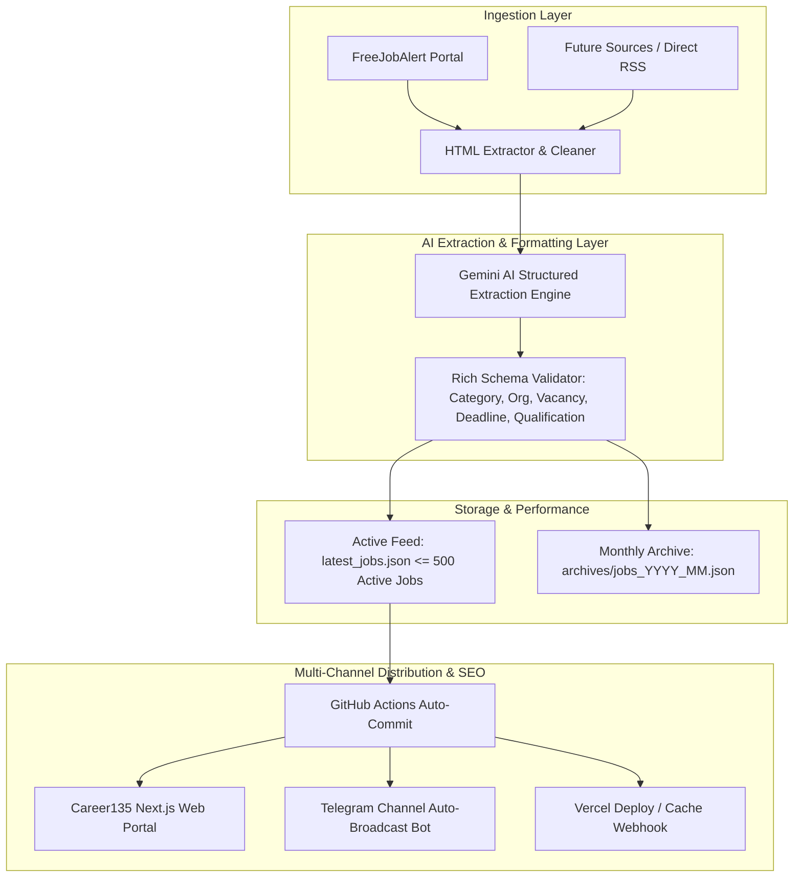

# Production-Grade Architecture & Upgrade Plan for Job Scraper Backend

## Executive Summary
This document outlines the engineering and business roadmap to upgrade the **Job Post AI Scraper Backend** (`job-scrapper-backend`) into an enterprise-grade, high-throughput, and resilient data ingestion engine for **Career135**.

---

## 1. Core Objectives & System Architecture



---

## 2. Key Improvement Pillars

### Pillar 1: Rich Structured Data & Gemini Prompt Optimization
Upgrade the Gemini LLM extraction prompt in `scraper.py` to produce complete metadata matching Google Jobs and schema.org requirements:

- **New Fields Added to Schema**:
  - `category`: `Government` | `Banking` | `Engineering` | `Healthcare` | `Defence` | `Teaching` | `State Exams`
  - `organization`: Standardized hiring body (e.g., `UPSC`, `SSC`, `RRB`, `AIIMS`, `BSNL`, `SBI`, `WBHRB`)
  - `vacancies`: Numeric or clean string (e.g. `22000`, `125`, `Multiple`)
  - `qualification`: Required degree (e.g. `10th/12th Pass`, `Graduate`, `B.Tech`, `GNM/B.Sc Nursing`, `MBBS`)
  - `deadline`: Application closing date (ISO format `YYYY-MM-DD` when available)
  - `location`: State name or `All India`
  - `age_limit`: (e.g. `18 - 30 Years`)
  - `salary`: Pay scale / stipend details
- **Enforce Absolute URLs**:
  - Enforce strictly formatted `https://...` links for `actual_link`.

---

### Pillar 2: Active Windowing & JSON File Size Optimization
- **Problem**: `latest_jobs.json` is currently ~6MB (2,500+ records) and growing indefinitely, causing git repo bloat and slowing down frontend SSR.
- **Solution**:
  - Keep `latest_jobs.json` trimmed to the latest **300–500 active/recent jobs** (~300 KB – 500 KB).
  - Automatically save full historical records into monthly archive files (`archives/jobs_2026_02.json`).

---

### Pillar 3: Scraping Engine Speed & Hybrid Fetching
- **Hybrid Fetching**:
  - Use `requests` / `urllib3` + `BeautifulSoup` for static articles (10x faster execution, 95% less RAM/CPU in GitHub Actions).
  - Use Selenium as a fallback only when anti-bot or dynamic JavaScript execution is required.
- **Deduplication Check**:
  - Check existing links before triggering heavy content extraction or Gemini API calls.

---

### Pillar 4: Automated Telegram Broadcast Bot (Traffic Growth Engine)
- Add a lightweight Telegram broadcast module to `scraper.py` or a dedicated script:
  - Uses Telegram Bot API (`https://api.telegram.org/bot<TOKEN>/sendMessage`).
  - Broadcasts formatted job notices with hashtags, summaries, and direct Career135 application links immediately upon generation.

---

### Pillar 5: Multi-Slot GitHub Actions Scheduling & Webhooks
- **Scheduled Triggers**: Update `.github/workflows/scrape.yml` to run 3 times daily:
  - `0 3,9,14 * * *` (8:30 AM, 2:30 PM, 7:30 PM IST).
- **Vercel Deploy Webhook**:
  - Optionally trigger a Vercel Deploy Hook after git push to invalidate and re-generate frontend cache automatically.

---

## 3. Environment Variables Reference (`.env`)

```env
# Google Gemini AI API Key
GOOGLE_API_KEY=your_gemini_api_key_here

# Telegram Channel Automation (Optional)
TELEGRAM_BOT_TOKEN=your_telegram_bot_token_here
TELEGRAM_CHANNEL_ID=@your_channel_id_or_chat_id

# Vercel Deploy / Revalidate Webhook (Optional)
VERCEL_DEPLOY_HOOK_URL=https://api.vercel.com/v1/integrations/deploy/...
```

---

## 4. Execution Checklist
- [ ] 1. Update `scraper.py` prompt with structured schema fields and protocol validation.
- [ ] 2. Implement active windowing and monthly archival logic in `scraper.py`.
- [ ] 3. Add Telegram Bot automatic notification function.
- [ ] 4. Update `requirements.txt` and `.env.example`.
- [ ] 5. Update `.github/workflows/scrape.yml` schedule and workflow steps.
- [ ] 6. Test scraper execution and verify output JSON structure.
